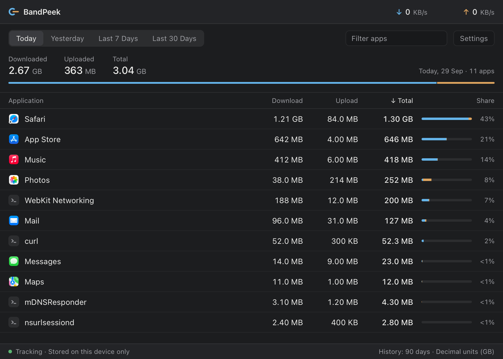
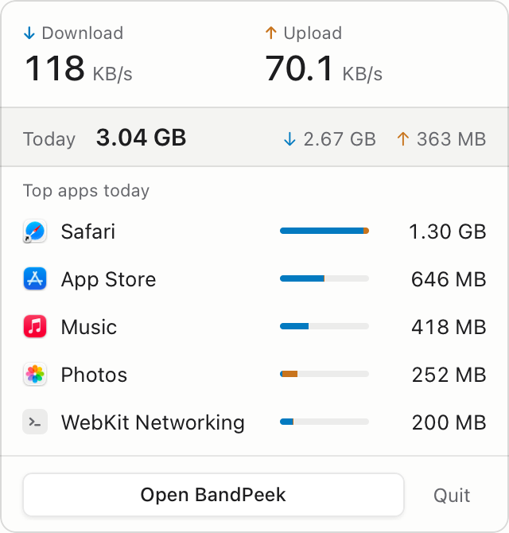
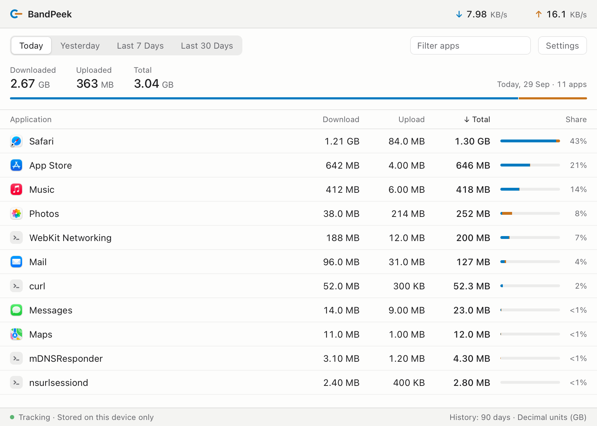

# BandPeek

**See which apps are using your network, and how much, from the menu bar.**

BandPeek is a free, open-source (MIT) menu-bar app. It shows live download and upload speeds in the menu bar, today's usage and top apps in a popup, and a history window with per-app totals for Today, Yesterday, the last 7 days and the last 30 days. Everything stays on your Mac.

<p align="center">
  
</p>
<p align="center">
  
  
</p>

<sub>Screenshots use a demo database, not real usage.</sub>

## Status

| Platform | Status |
|---|---|
| **macOS** | **Public beta, 0.1.0-beta.1.** Apple Silicon, macOS 13 or later. Tested on macOS 27 only. |
| Windows | Not implemented. |
| Linux | Not implemented. |

The collector architecture is designed so other platforms can be added later, but nothing for Windows or Linux exists yet.

Beta builds are **not signed with an Apple Developer ID or notarized** yet (see [Install](#install)). There is no auto-update.

## What it does

- **Menu bar:** the BandPeek mark with live ↓/↑ rates, updated every 5 seconds.
- **Popup:** current speeds, today's total, and the top five apps today.
- **Main window:** per-app download, upload, total and share for Today, Yesterday, Last 7 Days and Last 30 Days. You can sort and filter the list.
- **Settings:** appearance (System/Light/Dark), units (GB or GiB), history retention (30 days to 1 year), clear history, and **Open at login**.
- Closing the window keeps BandPeek in the menu bar. Quit from the popup or with Cmd+Q.

## What the numbers mean

BandPeek shows a **best-effort estimate of the TCP/UDP traffic each app's sockets sent and received**, as reported by macOS (`nettop`), sampled every 5 seconds. It is **not** an ISP meter, a billing meter or a wire-level (packet) meter, and its totals will not match your provider's.

- **All network interfaces**, including local network (LAN) and loopback traffic. There is no Wi-Fi/Ethernet split.
- **Very short-lived processes can be missed.** A process that starts, transfers data and exits between samples may not be counted.
- **Shared system helpers stay separate.** Processes such as *WebKit Networking*, *mDNSResponder* or *nsurlsessiond* carry traffic for other apps. BandPeek lists them on their own and doesn't guess which app they worked for.
- **Durability.** Traffic is saved about once a minute, so an abrupt crash or power loss can lose up to about a minute of recent activity.
- Time asleep and collector restarts are recorded as gaps; nothing is estimated for them.

The full evidence and limits are in the [macOS accuracy contract](docs/macos-accuracy-contract.md) and the milestone reports in [`docs/`](docs).

## Privacy

- Local only: no accounts, cloud, analytics, telemetry, crash reporting, update checks or remote assets.
- BandPeek reads per-process byte counters and local app metadata (names, bundle IDs, icons). It does **not** record destinations, domains, URLs or packet contents.
- No administrator rights, Full Disk Access, network extension or packet capture.
- History (`bandpeek.db`, per-minute totals per app) and `settings.json` are stored in `~/Library/Application Support/BandPeek/`. **Settings → Clear History** deletes the history. History older than your retention setting is deleted automatically.

## Install

### Build from source (recommended while the beta is unsigned)

Requirements: macOS 13+ on Apple Silicon, Node.js 22.12+, Rust stable, Xcode Command Line Tools.

```sh
git clone <this repository>
cd bandpeek
npm ci
npm run desktop:bundle
```

This produces `src-tauri/target/release/bundle/macos/BandPeek.app` and `src-tauri/target/release/bundle/dmg/BandPeek_0.1.0-beta.1_aarch64.dmg`. Copy BandPeek.app to `/Applications`. Apps you build yourself open normally.

### Pre-built beta

Pre-built beta builds are ad-hoc signed, not signed with a Developer ID or notarized by Apple, so macOS will block the first launch of a downloaded copy. Only use one you obtained from this project, and check it against the published SHA-256 checksum. If you still want to open it, use Apple's documented override: open it once, then go to **System Settings → Privacy & Security** and click **Open Anyway** for BandPeek ([Apple support](https://support.apple.com/102445)). Don't disable Gatekeeper. Developer ID signing and notarization are planned before a wider release.

### Open at login

Settings → **Open at login** registers BandPeek with macOS (`SMAppService`, the same list as System Settings → General → Login Items). When macOS starts it at login, BandPeek opens in the menu bar only, without a window. You can also switch it off in System Settings. Open at login is only available in the installed app, not in the development build.

## Development

```sh
npm ci
npm run desktop                    # development app
npm run build                      # TypeScript check + Vite build
cargo test --manifest-path src-tauri/Cargo.toml
cargo clippy --manifest-path src-tauri/Cargo.toml --all-targets -- -D warnings
npm run desktop:build              # release binary without bundling
npm run desktop:bundle             # .app + .dmg
```

A collector-only CLI prints JSON snapshots (same core as the app):

```sh
cargo run --release --manifest-path src-tauri/Cargo.toml --no-default-features --features probe --bin bandpeek-probe -- 60
```

**Layout.** `src-tauri/src/collectors/` holds the platform collector boundary; `macos/` owns the `nettop` worker, CSV parsing and process identity. The other core modules:
- `aggregate.rs`: counters
- `db/`: SQLite history
- `presentation.rs`: display names
- `settings.rs`: preferences

`src-tauri/src/shell/` is the desktop shell: commands, windows, menu-bar item, Launch at Login, and validation-only hooks. `src/` is the React UI.

The validation and measurement scripts in `scripts/` run against release builds; see [CONTRIBUTING.md](CONTRIBUTING.md). Their raw output goes to the git-ignored `.validation/` directory and can contain local app names and paths, so don't publish it unreviewed. Release checks that need a person are listed in [docs/manual-checks.md](docs/manual-checks.md).

## Documentation

- [macOS accuracy contract](docs/macos-accuracy-contract.md) and [collector decision](docs/collector-decision.md)
- Milestone reports:
  - [1: collector](docs/validation.md)
  - [2: accuracy](docs/milestone-2.md)
  - [2.5: cadence](docs/milestone-2.5.md)
  - [3: persistence](docs/milestone-3.md)
  - [4: UI](docs/milestone-4.md)
  - [5: beta hardening](docs/milestone-5.md)
- [Manual release checks](docs/manual-checks.md)

## Contributing

Issues and pull requests are welcome; see [CONTRIBUTING.md](CONTRIBUTING.md). Please don't attach your own usage databases or raw validation output.

## License

[MIT](LICENSE)
